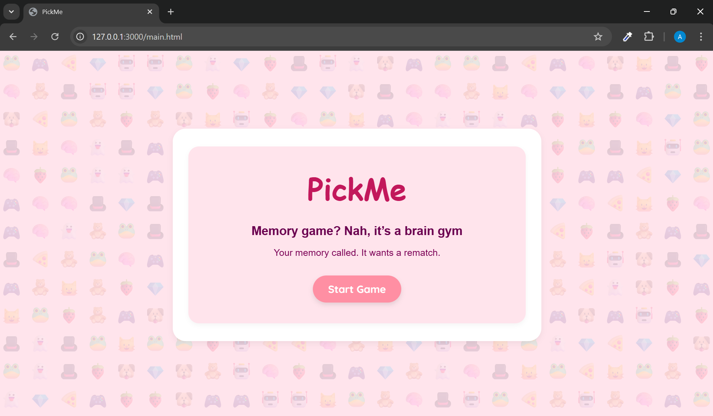
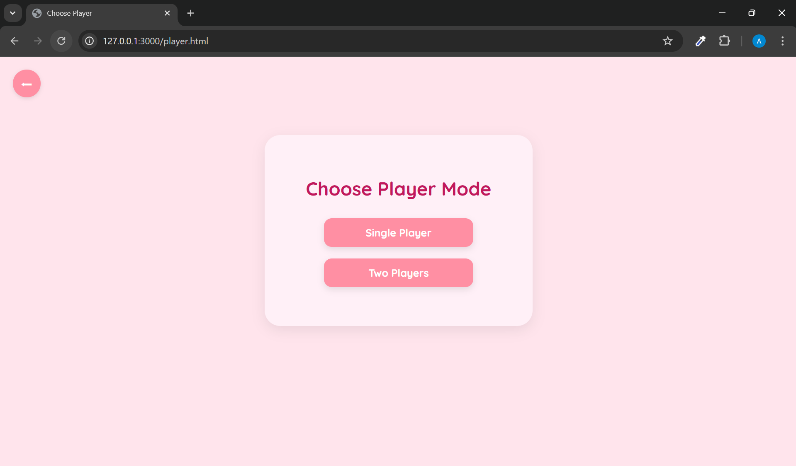
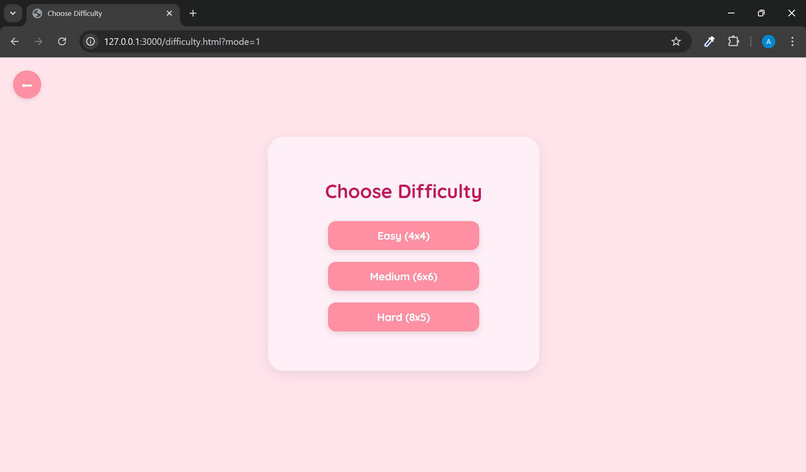
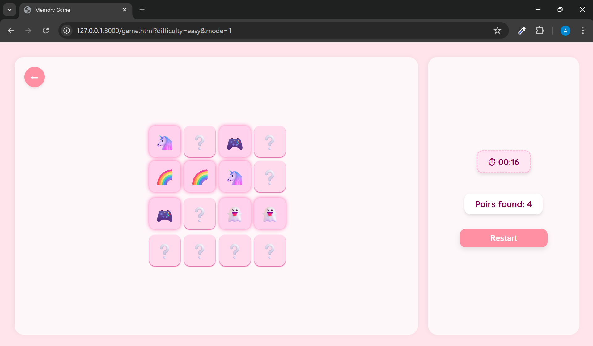
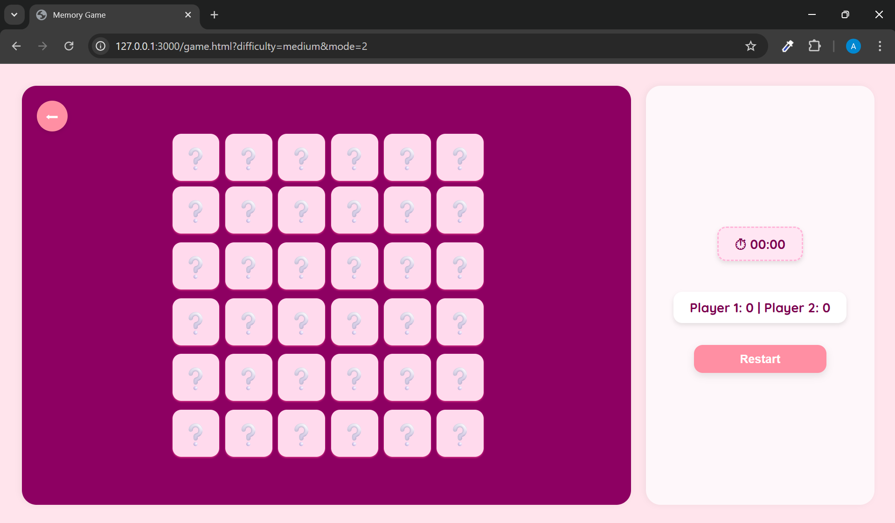

# PickMe - Memory Game

**PickMe** is a retro-themed memory card game built using **HTML, CSS, and JavaScript**. Choose between single or two-player modes and challenge your memory across different difficulty levels.

---

## Features

- Single and Two Player Modes
- Three Difficulty Levels: Easy (4x4), Medium (6x6), Hard (8x5)
- Timer and Live Scoreboard
- Restart and Back Button Navigation
- End Game Popups with Fun Quotes
- Retro UI Design with Emoji Wallpaper Background

---

## How to Play

1. Click "Start Game" on the main page.
2. Choose between "Single Player" or "Two Players".
3. Select your preferred difficulty level.
4. Flip cards to find matching pairs.
5. Match all pairs to win and view your final score.

---

## Built With

- HTML5
- CSS3
- JavaScript (Vanilla JS)
- Google Fonts: Quicksand, Rubik, Press Start 2P

---

## Project Structure

PickMe/
├── project_images/
│   ├── home_page.png
│   ├── choose_player.png
│   ├── choose_difficulty.png
│   ├── game_board_singleplayer_easy.png
│   └── game_board_twoplayers_medium.png
├── index.html
├── style.css
├── script.js
└── README.md

---

## Screenshots

### Home Page

### Choose Player

### Choose Difficulty

### Single Player - Easy Board

### Two Players - Medium Board

